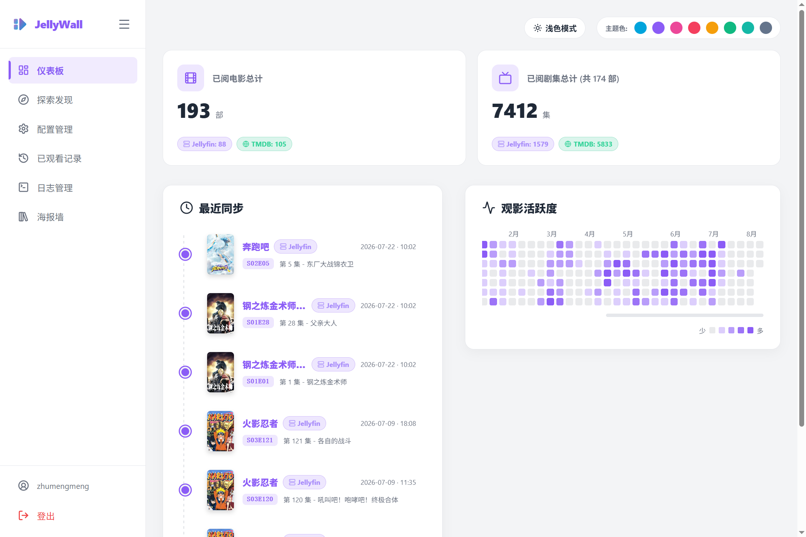
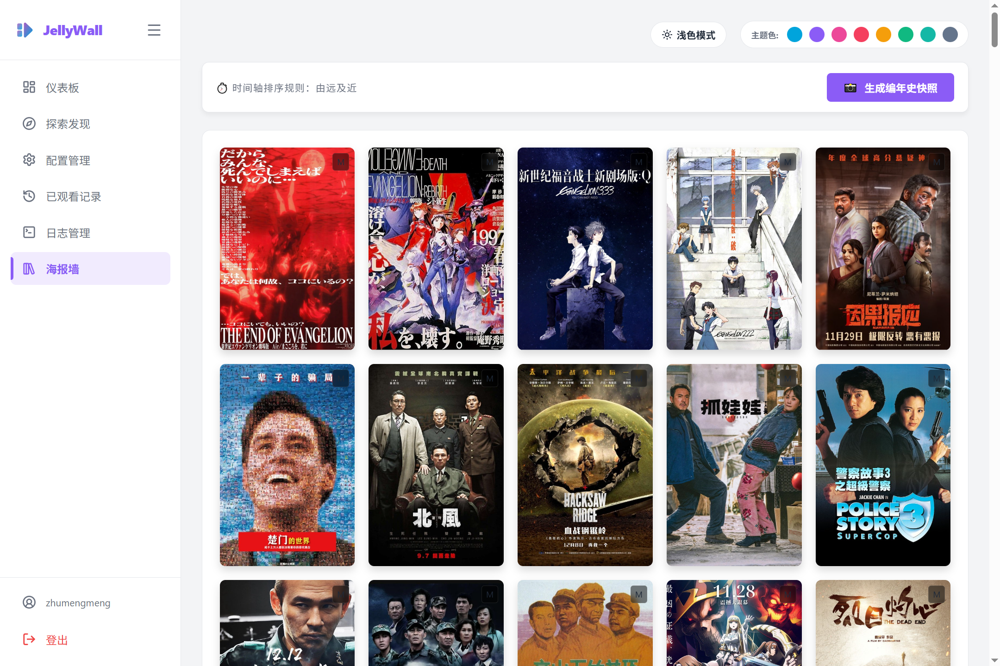
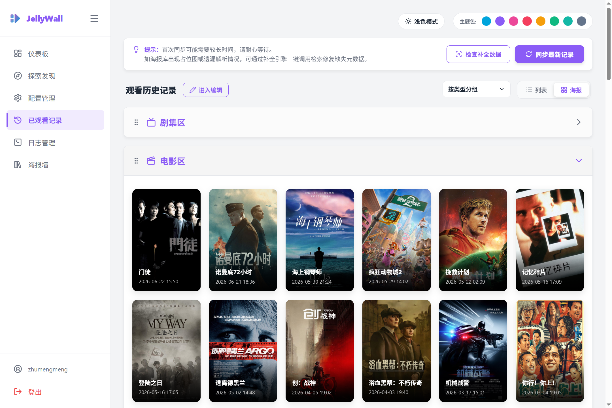
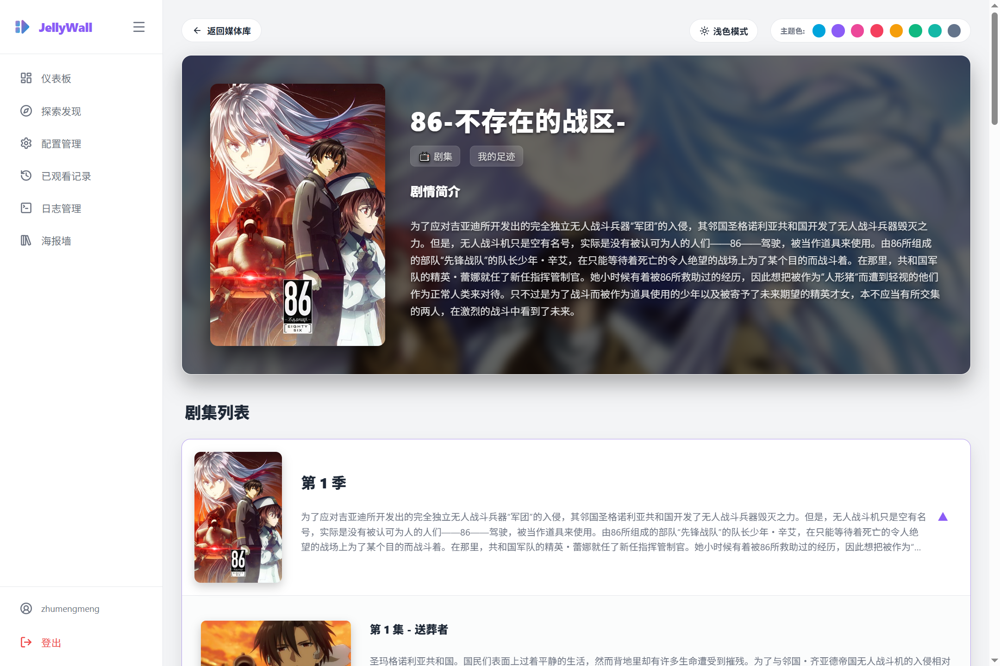

# JellyWall

把 Jellyfin 的观看历史,变成一份值得长期翻阅的个人观影档案。

JellyWall 是一套面向个人与家庭的观影记录管理方案。它以 Jellyfin 媒体服务器为核心数据源,自动同步你看过的每一部电影和每一集剧集,借助 TMDB 补齐中文元数据与视觉素材,再以海报墙、统计看板和活跃度热力图等形式,把零散的播放记录整理为结构清晰、可长期沉淀的媒体档案。项目采用轻量架构,本地存储、无外部服务依赖,适合部署在 NAS 或家庭服务器上长期运行。

| 项目速览 | |
| --- | --- |
| 定位 | 观影历史记录与可视化档案管理 |
| 数据源 | Jellyfin(观看记录)+ TMDB(元数据与图片) |
| 存储 | SQLite 本地数据库 + 本地图片缓存 |
| 部署形态 | 单进程 Web 服务,支持 Docker |
| 使用场景 | 个人 / 家庭媒体库,多用户 |
| 当前版本 | v1.0.1 |

## 📖 项目介绍

Jellyfin 本身提供了完整的媒体管理能力,但观看历史的呈现方式相对有限:播放记录只是数据,缺少持续可回看、可整理的可视化形态。JellyWall 解决的就是这个问题——它把"播放历史"提升为"观影档案",让用户能够直观回顾看过什么、何时开始看、观看节奏如何,同时为这些记录提供完整的数据管理能力。

项目在架构上刻意保持轻量:核心服务由单一 Flask 应用承担,数据落在本地 SQLite,媒体素材本地化缓存,不依赖任何第三方运行时服务。这种设计降低了部署与维护成本,也让数据始终掌握在用户自己手中,可随时导出备份或整体迁移。

## 💡 设计理念

JellyWall 源于实际使用中的需求。在评估现有工具时,Watcharr 提供了完整的记录与同步能力,但在中文海报和文字展示上有所欠缺;Bangumi Syncer 的界面精致,却更偏向番剧场景。结合两者的优点,并围绕自身媒体库的使用习惯持续迭代,最终形成了 JellyWall 的完整方案。

项目的设计遵循三个原则:功能围绕真实场景展开,不堆砌冗余特性;数据本地可控,支持随时导出与迁移;界面以清晰易读为前提,兼顾桌面与移动端使用。项目由 Gemini 协助完成初版开发,近期由 Codex 与 DeepSeek 进行性能优化与重构,持续保持代码质量与运行效率。

## ✨ 核心功能

### 数据同步

JellyWall 与 Jellyfin 深度集成,提供手动、实时与定时三种同步方式。定时同步基于 Cron 表达式,在后台自动增量更新本地记录;实时同步通过 Server-Sent Events 推送进度,同步过程对用户完全可见。同步引擎同时处理记录去重、时间校正与软删除复活,保证本地数据与媒体库状态一致。

### 可视化呈现

仪表板汇总观影总量、来源构成,并以年度热力图呈现观看活跃度,帮助用户快速了解整体观影节奏。海报墙按"首次观看时间"组织内容,还原每一部作品最初被观看的节点,支持一键导出为图片,形成可分享的观影编年史。历史记录页提供按媒体库与按类型两种视图,分别服务于追溯来源与查找整理两种使用习惯。

### 元数据与媒体素材

系统优先复用 Jellyfin 已刮削的 TMDB ID,缺失时自动以中文片名检索 TMDB,并下载海报、背景图与剧照到本地。素材本地化之后,页面展示不再依赖外部网络,同时规避了浏览器跨域加载图片的问题。

### 数据管理

观看记录、海报缓存与单集详情支持一键导出为 JSON 备份,也可从备份导入恢复。系统提供缺失数据体检,可扫描失效的 TMDB ID、缺失的海报路径与丢失的图片文件,并自动从 TMDB 补全。针对从 Watcharr 等平台迁移的场景,内置完整的事件时间线解析与导入流程,还原每一条记录的真实观看时间。

### 探索与补录

探索模块提供 TMDB 搜索与详情浏览,搜索结果与本地记录自动比对,标注观看状态。用户可以手动补录电影、整部剧集、整季或单集,补录内容连同中文元数据与剧照一并入库,弥补媒体库之外观看内容的记录空白。

### 运维与日志

日志面板将业务日志与底层 HTTP 日志分开展示,支持实时流查看、级别过滤与关键词搜索,系统每天自动归档前一日日志,避免日志文件无限增长。

## ⭐ 特色能力

首次观看时间捕获是 JellyWall 的核心算法之一。历史记录按时间升序处理,通过身份键去重锁定每条内容最早的观看记录,让海报墙呈现的不是"最近播放",而是"最初相遇"。

TMDB ID 智能嗅探提高了元数据匹配的可靠性:优先使用 Jellyfin 的刮削结果,缺失时以中文片名与年份回退检索,并在同步会话内缓存搜索结果,避免重复请求。

软删除与复活机制兼顾了数据安全与使用便利:删除仅标记记录,再次同步到相同内容时会自动恢复,误操作可以被自然修正。

## 🛠️ 技术架构

后端基于 Python 3.10 与 Flask 3.1 构建,使用 SQLite 存储,Flask-Login 管理用户会话,Flask-SQLAlchemy 负责数据访问,APScheduler 承担定时任务调度,requests 配合连接池与重试策略访问外部接口。实时能力通过 Server-Sent Events 提供,覆盖同步进度、日志流与数据补全等场景。

前端采用原生 HTML、CSS 与 JavaScript 的服务端渲染方案,Jinja2 模板组织页面结构,Lucide 提供图标体系,Sortable.js 实现拖拽交互,html2canvas 支持海报墙导出。界面支持深色与浅色主题、主题色自定义与移动端适配。

性能层面,数据库针对高频查询建立复合索引,同步与搜索过程避免 N+1 查询,日志读取采用尾部流式方案,静态资源启用浏览器缓存与 gzip 压缩。整体设计目标是在低功耗设备上保持流畅响应。

## 🚀 快速开始

本地运行需要 Python 3.10 及以上版本:

```bash
pip install -r requirements.txt
python app.py
```

服务默认监听 5000 端口。首次使用需注册账号,并按引导绑定 Jellyfin 服务器;在配置中心填写 TMDB API Key 后,即可启用元数据补全与探索功能。

使用 Docker 部署时,调整 `docker-compose.yml` 中的卷映射路径后执行:

```bash
docker compose up -d
```

配置、数据库、图片缓存与日志目录均通过卷映射持久化,容器重建不影响数据。

## 📁 项目结构

核心代码集中于根目录的 `app.py`,包含数据模型、路由、同步引擎与后台任务。`templates` 目录存放页面模板,`static` 目录存放前端资源与本地化图片缓存,`config` 目录保存用户配置与系统开关,`instance` 目录存放 SQLite 数据库,`logs` 目录存放运行日志。`main.py` 提供辅助脚本,用于将 Watcharr 导出数据整理为 CSV 清单。

## 📷 截图

以下为项目实际运行界面的截图,图片位于 `static/images` 目录,随仓库一并提交。

仪表板:



海报墙:



已观看记录:



剧集详情:



## 🗺️ 开发方向

项目持续围绕真实使用反馈迭代,近期方向包括:丰富数据可视化维度、优化大媒体库的渲染性能、完善多用户使用体验。项目以自用为前提开源,欢迎有类似需求的用户参考与使用。

## 🙏 致谢与反馈

感谢 Watcharr 与 Bangumi Syncer 为 JellyWall 提供了重要的设计灵感,本项目在记录逻辑与界面呈现上均参考了它们的优秀实践。

如果你在使用中遇到问题,或有新的功能需求与改进建议,欢迎通过 GitHub Issues 提交。每一条反馈都会被认真对待,并纳入后续迭代的评估范围。
